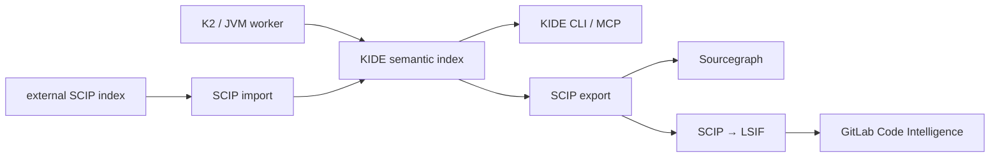

# Конкурентный анализ KIDE — `sudoHackIn/kide`

> Этот файл сохранен как первоначальный широкий обзор рынка. Уточненные выводы
> после проверки реализаций и локальных экспериментов вынесены в отдельные
> документы:
>
> - [`codebase-memory-mcp`: технический разбор](research/codebase-memory-mcp.md)
> - [`Claude-ast-index-search`: технический разбор](research/claude-ast-index-search.md)
> - [Codanna: технический разбор](research/codanna.md)
> - [SCIP, `scip-java` и Sourcegraph](research/scip-sourcegraph-scip-java.md)
> - [Позиционирование, идеи, эпики и приоритеты KIDE](research/kide-positioning-and-roadmap.md)
>
> При расхождении формулировок эти focused-документы следует считать более
> актуальными. В частности, Codanna теперь считается главным открытым direct
> product competitor, Serena — прежде всего workflow competitor, а SCIP,
> `scip-java` и Sourcegraph разделены на format, indexer baseline и platform.
> Проверка текущего KIDE также выявила два обязательных semantic gap:
> external-overload mapping и portable cross-artifact identity. Поэтому
> dependency moat и преимущество reuse считаются гипотезой до differential и
> cross-workspace benchmark. Актуальная очередь идей, эпиков и приоритетов
> находится в документе о позиционировании, а этот файл остается широким
> историческим обзором рынка.

## Резюме для принятия решений

[KIDE](https://github.com/sudoHackIn/kide) находится в очень интересной, но уже быстро заполняющейся нише: **headless semantic code intelligence для людей, CI и coding agents**. В PRD продукт определяется не как IDE и не как очередной LSP/MCP-wrapper, а как собственная персистентная модель проекта: symbols, references, types, calls, inheritance, dependencies и project graph, с Kotlin/JVM/K2 как первым семантическим backend и CLI/LSP/MCP/CI как клиентами этой модели. Та же концепция присутствует в загруженной версии PRD. fileciteturn17file0L1-L2 fileciteturn0file0

Мой главный вывод: **у KIDE нет одного конкурента, который полностью повторяет заявленную архитектуру, но практически каждый отдельный слой уже имеет очень сильного игрока**. Это одновременно риск и возможность.

Три наиболее близких конкурента:

| Место | Конкурент | Почему близок к KIDE | Главная угроза |
|---|---|---|---|
| **1** | **Serena** | Symbol-level retrieval, references, implementations, semantic editing/refactoring, MCP, Kotlin через LSP/JetBrains | Уже сформировала agent-first UX и имеет ~27.8k GitHub stars |
| **2** | **Sourcegraph + SCIP/scip-java** | Persistent/precomputed compiler-generated indexes, definitions/references/implementations, dependencies, cross-repo navigation | Очень зрелая индексная экосистема и фактический стандарт обмена semantic index data |
| **3** | **JetBrains Kotlin LSP** | IntelliJ/Kotlin-powered semantic correctness, Gradle/Maven, rename, call hierarchy, diagnostics | Практически эталонный Kotlin semantic frontend от владельца Kotlin |

Serena прямо позиционируется как «IDE for your coding agent»: предоставляет symbol-level retrieval, references, implementations, editing и refactoring через MCP. По состоянию последнего доступного снимка GitHub у проекта около **27.8k stars, 1.8k forks и 3,292 commits**. Бесплатный backend использует language servers, а более полный платный JetBrains backend добавляет dependency navigation, type hierarchy и расширенные refactorings. citeturn17view0

Sourcegraph решает другую половину задачи KIDE: compiler/indexer-produced semantic knowledge, которое можно вычислить заранее и использовать независимо от IDE. SCIP — language-agnostic Protobuf-протокол для definition/reference/implementation navigation; `scip-java` поддерживает Java, Scala и Kotlin. Сам SCIP — Apache-2.0 и имеет порядка 0.6–0.7k stars и 16 releases; `scip-java` — более 120 stars и 60 releases. Текущий Sourcegraph коммерчески предлагает code search/navigation, MCP, API/CLI, Batch Changes и self-hosted/single-tenant deployment; текущий Enterprise начинается от $16k. citeturn16search1turn16search5turn16search0

JetBrains Kotlin LSP уже поддерживает актуальные версии Kotlin, IntelliJ-powered completion/diagnostics, Gradle, Maven, experimental AGP, rename, organize imports и call hierarchy. Однако проект остается **Alpha**, LSP/editor-oriented и частично закрытым, поскольку использует proprietary части JetBrains Air/Fleet. citeturn15search1

Отсюда стратегическое позиционирование KIDE я бы сформулировал так:

> **KIDE should be the persistent, compiler-authoritative semantic database for code — not merely another code-search server, LSP wrapper or MCP graph.**

То есть выигрышная территория находится на пересечении четырех свойств:

**compiler-authoritative semantics × persistent normalized index × headless/agent-native API × safe programmable transformations.**

Именно эту комбинацию рынок пока не закрыл одним очевидным лидером. Это аналитический вывод из сравнения архитектур Serena, SCIP/Sourcegraph, Kotlin LSP, CodeQL, GitLab Orbit и agent-oriented graph tools. citeturn17view0turn16search1turn15search1turn21search0turn19search3turn15search0

Самые важные стратегические действия для KIDE, на мой взгляд:

1. **Сделать Kotlin/JVM semantic correctness главным moat, а не количество языков.** Не пытаться сейчас догнать инструменты с «40+» или «158 languages». Нужно доказать точность overload resolution, extensions, generics, Java interop, inheritance, dependency JAR symbols и incremental invalidation.
2. **Выпустить MCP раньше большинства сложных refactoring features.** Agent-first рынок уже подтвержден Serena, codebase-memory-mcp, Codanna, GitLab Orbit и Atlassian Code Context. citeturn17view0turn15search0turn21search5turn19search3turn20search2
3. **Поддержать SCIP import/export вместо попытки изобрести изолированный ecosystem format.** Это позволит KIDE выступать и конкурентом Sourcegraph, и генератором/потребителем его индексов; GitLab уже умеет принимать SCIP после conversion в LSIF. citeturn16search1turn16search5turn19search0
4. **После read/query path инвестировать в semantic WorkspaceEdit/refactoring.** Именно здесь можно соединить headless architecture KIDE с возможностями, которые сегодня наиболее полно дает IntelliJ/платный backend Serena.
5. **Content-addressed registry для dependency semantic artifacts стоит сохранить как долгосрочный differentiator.** Особенно для JVM, где один и тот же Maven/Gradle artifact анализируется тысячами проектов.

## KIDE сегодня: что реально находится в репозитории

### Состояние продукта

Важно отделять **PRD vision** от уже существующей реализации.

Репозиторий создан **13 августа 2026 года**, последний зафиксированный push в repository metadata был **18 августа 2026 года**. GitHub показывает **0 stars, 0 forks и 0 open issues**; description, homepage и topics пока не заданы. GitHub также не распознает лицензию репозитория. Это означает, что с точки зрения внешнего OSS-сигнала KIDE пока находится на стадии very-early engineering prototype, а не публично сформированного OSS-продукта. fileciteturn15file0L1-L6

При этом кодовая база заметно глубже, чем можно ожидать по внешним метрикам. Cargo workspace содержит как минимум `kide-core` и `kide-cli`, а корень проекта — отдельные `crates`, `workers`, `protocol`, `fixtures` и обширную `docs`-структуру. fileciteturn2file0 fileciteturn16file0L1-L6

| Параметр | Состояние |
|---|---|
| **README** | **Не указан / отсутствует в корне.** Вместо публичного README основное описание сейчас находится в `docs/KIDE_PRD_with_registry.md`. fileciteturn2file0 |
| **Product definition** | Headless persistent semantic code platform / project-wide code intelligence. fileciteturn17file0L1-L2 |
| **Основной язык implementation** | Rust; GitHub определяет Rust как основной язык репозитория. fileciteturn15file0L1-L6 |
| **Первый semantic backend** | Kotlin/JVM; Kotlin K2/compiler semantic engine. fileciteturn17file0L1-L2 |
| **Current worker** | `workers/kotlin-jvm`; Kotlin JVM 2.4.10, compiler embeddable, Gradle Tooling API, Maven model, ASM, Protobuf; Java toolchain 21. fileciteturn13file0L1-L6 fileciteturn14file0L1-L6 |
| **CLI** | Уже существуют `index`, `status`, `text`, `symbols`, `select`, `definition`, `refs`, `implementations`, `callers`, `type-at`, а также generic `query`; есть JSON mode. fileciteturn12file0L1-L6 |
| **Persistence/indexing** | В core присутствуют store, artifact cache/query, freshness, text index, semantic query/capability, orchestration, supervisor/worker registry и project/framework query modules. fileciteturn6file0 |
| **LSP** | **Planned**, но в текущем CLI/корневых modules подтвержденной законченной LSP surface нет. PRD рассматривает LSP как frontend. fileciteturn17file0L1-L2 |
| **MCP** | **Planned** в PRD; текущий CLI API его еще не демонстрирует. fileciteturn17file0L1-L2 fileciteturn12file0L1-L6 |
| **Inspections / SARIF** | **Planned**. |
| **Refactoring engine** | **Planned**: rename, move class/package, change signature и др.; current CLI пока read/query-focused. fileciteturn17file0L1-L2 |
| **Extension runtime** | **Planned**: custom queries, inspections, operations; варианты WASM/external process рассматриваются архитектурно. fileciteturn17file0L1-L2 |
| **Registry/CAS** | Стратегическая часть PRD, а не доказанная production capability текущего CLI. fileciteturn17file0L1-L2 |
| **OS support** | **Не указан явно.** Нельзя корректно заявлять Windows/Linux/macOS support только на основании текущего исходного кода. |
| **Build systems** | Gradle явно интегрирован в JVM worker; Maven model dependency присутствует, но последний commit называется `wip: start Maven project discovery`, поэтому Maven следует считать незавершенным. fileciteturn14file0L1-L6 fileciteturn19file0L1-L2 |
| **License** | Cargo workspace metadata указывает **MIT**, но root `LICENSE` отсутствует, а GitHub API возвращает `license: null`. Юридическое оформление OSS поэтому пока неполное. fileciteturn15file0L1-L6 |
| **Version** | Workspace version `0.1.0`. |
| **Releases** | **Не установлено / unspecified.** Доступные repository metadata не дают подтвержденного release count; версию `0.1.0` не следует автоматически считать публичным GitHub Release. |
| **Contributors** | **Точное число unspecified.** Последний commit записан от `vladislav`, но это не позволяет корректно вывести общее число contributors. fileciteturn19file0L1-L2 |
| **Commits** | GitHub connector при выборке истории вернул не менее 100 записей за первые дни разработки; это безопасный нижний предел выборки, а не точный total. Последний доступный commit — `wip: start Maven project discovery`, 18 августа 2026. fileciteturn19file0L1-L2 |
| **Issues** | 0 open GitHub issues на момент repository metadata. fileciteturn15file0L1-L6 |

### Архитектурная идея

PRD предлагает достаточно сильное архитектурное разделение:

```text
                 clients
       CLI / MCP / LSP / CI
                 │
                 ▼
         KIDE Core — Rust
     project model / query engine
     persistent semantic index
     freshness + invalidation
     artifact/dependency storage
                 │
            worker protocol
                 │
                 ▼
       Kotlin/JVM semantic worker
        Kotlin K2 / compiler APIs
                 │
                 ▼
       normalized semantic facts
                 │
                 └──────► persisted back in KIDE
```

Ключевое решение — **language compiler не должен быть database runtime для каждого запроса**. K2 используется как semantic authority для вычисления достоверных фактов, после чего normalized references/types/calls/hierarchy сохраняются в собственном индексе KIDE. PRD также вводит freshness states `FRESH / STALE / UNKNOWN` и допускает disposable/on-demand semantic workers. fileciteturn17file0L1-L2

Это существенно отличает KIDE от простого:

```text
MCP → LSP → answer
```

или:

```text
Tree-sitter → graph → search
```

В текущем коде это уже частично отражено наличием Rust-side semantic/query/store/freshness/orchestration modules и отдельного JVM worker, который использует Kotlin compiler embeddable и Protobuf. fileciteturn6file0 fileciteturn14file0L1-L6

### Кто является целевым пользователем

Из PRD следует четыре основных сегмента: **разработчики**, которым нужна headless navigation/analysis; **coding agents**, которым нужен структурированный semantic tool API; **editors**, использующие KIDE через LSP; и **CI/engineering platforms**, запускающие inspections/queries без GUI IDE. fileciteturn17file0L1-L2

На текущем этапе наиболее реалистичны два первых use case:

**CLI/agent semantic navigation** и **CI/query engine**.

Полноценная конкуренция с IDE наступит намного позже, потому что refactoring, inspection, LSP и extension surfaces пока в основном находятся в PRD.

## Карта конкурентного рынка и охват поиска

Поиск показывает четыре соседних конкурентных кластера.

```mermaid
flowchart TB
    K["KIDE<br/>Persistent compiler-authoritative<br/>semantic code model"]

    subgraph A["Agent-native semantic tooling"]
        SER["Serena<br/>MCP + symbol edits/refactors"]
        CBM["codebase-memory-mcp<br/>persistent knowledge graph"]
        COD["Codanna<br/>local index + MCP/CLI"]
    end

    subgraph B["Persistent / cross-repo code intelligence"]
        SG["Sourcegraph + SCIP<br/>precise precomputed indexes"]
        GL["GitLab Code Intelligence / Orbit<br/>LSIF + code/SDLC graph"]
        KY["Kythe<br/>index + xrefs infrastructure"]
    end

    subgraph C["Compiler / IDE semantic authority"]
        IJ["IntelliJ IDEA<br/>PSI + Kotlin semantics + refactors"]
        KL["JetBrains Kotlin LSP<br/>IntelliJ-powered Kotlin"]
        QO["Qodana<br/>headless IntelliJ inspections"]
    end

    subgraph D["Queryable program databases"]
        CQL["CodeQL<br/>semantic DB + query language"]
        JO["Joern<br/>Code Property Graph"]
    end

    subgraph E["Semantic code search"]
        AT["Atlassian Code Context<br/>lexical + embeddings"]
    end

    K --- SER
    K --- SG
    K --- KL
    K --- CBM
    K --- COD
    K --- GL
    K --- IJ
    K --- CQL
    K --- QO
    K --- JO
    K --- KY
    K --- AT
```



Это не просто теоретические категории. Agent-native сектор уже очень активен: Serena предлагает semantic retrieval/editing через MCP, `codebase-memory-mcp` строит локальный persistent knowledge graph для 158 языков и комбинирует Tree-sitter с собственным hybrid semantic resolution, а Codanna предоставляет локальный persistent code index, semantic search, call graph и MCP/CLI. citeturn17view0turn15search0turn21search5

Persistent-index сектор занят прежде всего SCIP/Sourcegraph и SCM platforms. SCIP определяет language-neutral semantic index protocol с indexers для Kotlin/Java/Scala, Rust, TypeScript и других языков. GitLab Code Intelligence принимает LSIF и позволяет конвертировать SCIP → LSIF; новый **GitLab Orbit**, находящийся в Beta, строит queryable property graph над source code и SDLC и имеет локальный `orbit` CLI с DuckDB. citeturn16search1turn19search0turn19search3turn19search9

Bitbucket-native ближайший сосед сейчас не compiler semantic engine, а **Atlassian Code Context**: lexical + vector semantic search по connected repositories, incremental re-indexing и доступ из Teamwork Graph CLI для coding agents. В августе 2026 Atlassian анонсировала multi-repo Code Context для агентов; документация описывает GitHub support/open beta и rollout к Bitbucket, а архитектурно это embeddings/chunk retrieval, а не точное compiler symbol resolution. citeturn20search0turn20search1turn20search2

В discovery также проверялись GitHub Topics/Awesome-style каталоги и продуктовые каталоги. Наиболее релевантные повторяющиеся категории там — code search, code graph, MCP code intelligence, static analysis и compiler indexes; чисто lexical/search-first проекты вроде Zoekt или Sourcebot я не включал в top comparison, поскольку они не решают основной semantic-model problem KIDE. Product Hunt/AlternativeTo полезны для discovery, но технические характеристики ниже намеренно опираются преимущественно на primary GitHub repositories и official documentation. G2 для этой узкой developer-infrastructure категории оказался значительно менее информативен, поэтому не используется как источник архитектурных утверждений.

Русскоязычных первичных технических материалов у этих проектов практически нет; поэтому приоритет отдан официальным англоязычным документациям и исходным репозиториям, а не русскоязычным перепечаткам.

Для `Overlap score` я использовал не популярность, а функциональную близость к целевой модели KIDE:

**5/5** означает почти тот же user problem и architecture surface; учитываются semantic correctness, persistent project model, headless/API operation, Kotlin/JVM relevance, agent/CI applicability и edit/refactoring capabilities.

## Сравнение ключевых конкурентов

| Name | URL | OSS / Commercial | Key features относительно KIDE | License / Price | Maturity metrics | Overlap score | Notes |
|---|---|---|---|---|---|---:|---|
| **Serena** | [GitHub](https://github.com/oraios/serena) | OSS + commercial backend | MCP; symbol lookup; references; implementations; diagnostics; semantic/symbolic editing; rename; JetBrains backend добавляет dependency search/type hierarchy/move/inline/debugging | MIT; JetBrains backend платный, free trial; публичная цена в исследованных источниках не указана | ~27.8k stars, ~1.8k forks, 3,292 commits citeturn17view0 | **4.8** | **+** Уже отличный agent UX и edits. **−** Free backend зависит от возможностей конкретных LSP; dependency declarations/type hierarchy ограничены. KIDE может отличиться owned persistent semantic DB и Kotlin/K2 fidelity. citeturn17view0 |
| **Sourcegraph + SCIP / scip-java** | [Sourcegraph](https://sourcegraph.com/) / [SCIP](https://github.com/scip-code/scip) / [scip-java](https://github.com/sourcegraph/scip-java) | Commercial platform + OSS protocol/indexers | Precomputed precise code nav, definitions/references/implementations, dependency navigation, cross-repo indexing, MCP/API/CLI | SCIP/scip-java Apache-2.0; Sourcegraph Enterprise starts at **$16k** | SCIP ~0.6–0.7k stars, 16 releases; scip-java ~120 stars, 60 releases citeturn16search8turn16search5turn16search0 | **4.6** | **+** Самая важная существующая semantic-index ecosystem. **−** Sourcegraph ориентирован на centralized code understanding/search, а не локальный semantic edit engine. Для KIDE лучше интегрироваться через SCIP, а не бороться с форматом. |
| **JetBrains Kotlin LSP** | [GitHub](https://github.com/Kotlin/kotlin-lsp) | Hybrid | IntelliJ-powered Kotlin semantics, completion, diagnostics/quick fixes, Gradle/Maven, rename, imports, formatting, call hierarchy | Repository Apache-2.0; implementation частично closed source | ~3.3k stars, ~80 forks, ~986 commits, 7 releases в исследованном снимке; статус Alpha citeturn15search1 | **4.5** | **+** Semantic authority максимально близка Kotlin IDE experience. **−** LSP/editor-centric, Alpha, частично закрыт; нет заявленного KIDE-like reusable persistent semantic DB/API. |
| **codebase-memory-mcp** | [GitHub](https://github.com/DeusData/codebase-memory-mcp) | OSS | Persistent graph, call chains, definitions, impact analysis, Cypher-like queries, semantic search, MCP; 158 Tree-sitter languages + hybrid semantic resolution including Kotlin | MIT | **36.7k stars**, 2.9k forks; 6,768 tests заявлены проектом; macOS/Linux/Windows binaries citeturn15search0 | **4.3** | **+** Очень сильная agent-native packaging и huge language coverage. **−** Основа — structural Tree-sitter graph + hybrid resolution, а не compiler-authoritative K2 model; safe compiler-validated refactoring не является ядром. |
| **Codanna** | [GitHub](https://github.com/bartolli/codanna) | OSS | Local persistent index, symbols/calls/dependencies, semantic search, impact context, MCP + CLI, watch mode; Kotlin входит в поддерживаемые языки | Apache-2.0 | ~712 stars, 66 forks; 15 языков; Windows experimental citeturn21search5 | **4.1** | **+** Очень близкий headless local Rust/MCP form factor. **−** Фокус сильнее на retrieval/search/graph, чем на compiler-grade Kotlin semantics и semantic transformations. |
| **GitLab Code Intelligence + Orbit** | [Code Intelligence](https://docs.gitlab.com/user/project/code_intelligence/) / [Orbit](https://docs.gitlab.com/user/project/repository/knowledge_graph/) | Commercial/open-core platform | LSIF/SCIP-derived nav; Orbit property graph source + SDLC; definitions, cross-file refs/imports; Java/Kotlin and другие языки; local CLI/DuckDB; agent integration | GitLab Free $0; Premium **$29/user/mo annual**; Ultimate custom. Orbit Remote Premium/Ultimate; local tooling имеет более широкую availability | Orbit **Beta**; Code Intelligence production platform capability citeturn19search0turn19search3turn19search9turn18search0 | **4.0** | **+** Code graph уже связан с repositories/MRs/pipelines/security. **−** Orbit source graph сейчас преимущественно definitions/import references и point-in-time analysis; не K2-authoritative edit/refactor service. |
| **IntelliJ IDEA / IntelliJ Platform** | [GitHub](https://github.com/JetBrains/intellij-community) | Hybrid OSS/commercial | PSI/indexes, exact Kotlin/Java navigation, types, hierarchy, inspections, refactoring, build/project model — фактически functional gold standard KIDE хочет вынести headless | OSS platform/core Apache-2.0; unified IDEA имеет free core + premium functionality | ~20k+ stars, ~6k forks и >500k commits в публичном repository snapshot; extremely mature citeturn4search3turn13search2turn13search3 | **3.9** | **+** Максимальная глубина semantics/refactoring. **−** Большой IDE runtime и interactive-product architecture. Именно отсутствие GUI/IDE dependency — основная причина существования KIDE. |
| **CodeQL** | [GitHub](https://github.com/github/codeql) | Hybrid OSS/commercial | Queryable semantic database, calls/types/dataflow, custom query language, Java/Kotlin analysis, CI/security automation | Query libraries MIT; CodeQL CLI/engine separately licensed; closed-source analysis может требовать commercial entitlement | **9.6k stars**, 2k forks citeturn21search0 | **3.6** | **+** Очень сильное доказательство ценности «code as queryable database». **−** Security/static-analysis workflow; database generation/batch queries, не low-latency editor/agent navigation и не refactoring API. Kotlin входит в compiled-language CodeQL DB flow. citeturn21search6turn21search3 |
| **Qodana** | [Product](https://www.jetbrains.com/qodana/) | Free + commercial | Headless IntelliJ inspections, Kotlin/Java, Gradle/Maven, K2, CI quality gates | JVM Community free; Ultimate в исследованной pricing info — около **$5 per active contributor/month** billed annually | Actively maintained 2026.x product; public star metric не является meaningful maturity proxy citeturn5search0turn5search2turn5search7 | **3.4** | **+** Доказывает, что IntelliJ/K2 capabilities востребованы headless в CI. **−** Product abstraction — inspection/code quality, а не general semantic query/model/refactor engine. |
| **Joern** | [GitHub](https://github.com/joernio/joern) | OSS | Persistent Code Property Graph, AST/CFG/data-flow/call relations, graph DSL, Kotlin/Java support | Apache-2.0 | ~3.2–3.4k stars, ~414+ forks, **2,816 releases**; latest cited v4.0.548 May 27 2026 citeturn21search1turn21search8 | **3.3** | **+** Очень зрелый graph/query model, мощный static-analysis/dataflow слой. **−** Vulnerability/program-analysis orientation; не IDE-equivalent exact semantics, incremental editor service или safe refactoring engine. |
| **Kythe** | [GitHub](https://github.com/kythe/kythe) | OSS | Language-agnostic indexing architecture, symbol/xref services, extractors/indexers, cross-reference graph | Apache-2.0 | ~2.1k stars, ~270 forks, >5.5k commits в исследованном snapshot citeturn6view0 | **2.9** | **+** Архитектурный precedent для durable code knowledge/xrefs. **−** Менее agent-oriented, ограниченная прямая Kotlin story и практически нет edit/refactoring product surface. |
| **Atlassian Code Context** | [Docs](https://support.atlassian.com/organization-administration/docs/what-is-code-context/) | Commercial | Multi-repo lexical + semantic/vector search, permission-aware indexing, incremental updates, Rovo/TWG CLI context for agents, GitHub/Bitbucket | Atlassian Cloud Standard/Premium/Enterprise; отдельная standalone price для Code Context в источнике не указана | Open beta / staged rollout; no comparable public GitHub stars citeturn20search0turn20search1 | **2.2** | **+** Очень сильный distribution через Jira/Confluence/Bitbucket и agents. **−** Chunk/embedding retrieval ≠ exact symbol/type/reference semantics; не refactoring engine. |

### Почему Serena — самый прямой продуктовый конкурент

По пользовательскому workflow Serena сегодня ближе всего к тому, чем KIDE хочет стать для agents.

Она уже дает агенту не line-oriented primitives, а `find symbol`, references, implementations, diagnostics и symbolic editing; через JetBrains backend доступны dependency navigation, hierarchy и более сложные refactorings. Она напрямую поддерживает Codex, Claude Code и другие MCP consumers. citeturn17view0

Но это одновременно подсказывает KIDE нишу.

У Serena semantic ownership находится в backend:

```text
Agent
  │
Serena MCP
  │
  ├── Language Server
  └── JetBrains IDE/plugin
```

У KIDE предполагается:

```text
Agent
  │
KIDE MCP/API
  │
Persistent KIDE semantic model
  │
K2 worker only when semantics must
be derived / refreshed / validated
```

Если KIDE действительно реализует этот контракт, он сможет давать agent tooling без постоянного LSP/IDE runtime и, потенциально, с намного лучшей повторной стоимостью запросов по уже вычисленным фактам. Это пока **архитектурное преимущество на бумаге**, а не доказанное benchmark advantage. fileciteturn17file0L1-L2 citeturn17view0

### Почему Sourcegraph/SCIP особенно важен

Sourcegraph не обязательно нужно считать только конкурентом — это, вероятно, **самая ценная потенциальная интеграция**.

SCIP уже стандартизует ровно часть данных, которой занимается KIDE:

```text
document
symbols
occurrences
definitions
references
implementations
relationships
```

и `scip-java` умеет Java/Scala/Kotlin. citeturn16search1turn16search5

Поэтому KIDE имеет смысл уметь:

```text
KIDE semantic index
      │
      ├── export SCIP
      │
      └── import SCIP
```

Тогда один и тот же KIDE JVM backend потенциально сможет обслуживать собственный CLI/MCP/LSP **и** генерировать индекс для Sourcegraph/GitLab. GitLab сегодня прямо документирует SCIP→LSIF conversion как путь загрузки code intelligence. citeturn19search0

Это превращает прямого конкурента в distribution channel.

### Почему Kotlin LSP одновременно конкурент и validation signal

Kotlin LSP подтверждает две вещи.

Во-первых, спрос на non-IDE Kotlin intelligence реален. Во-вторых, JetBrains сама считает использование IntelliJ/Kotlin internals приемлемой архитектурой для language server, то есть KIDE правильно не пытается самостоятельно реализовать сложные правила Kotlin resolution. citeturn15search1

KIDE должен выигрывать здесь **не** completion/UI parity, а другими свойствами:

```text
Kotlin LSP                   KIDE
-----------                  ----
document/position API        project/symbol API
interactive editor           CLI / agent / CI / editor
live server semantics        persisted semantic facts
LSP is primary surface       LSP is one adapter
editor refactor UX           programmable WorkspaceEdit
single project interaction   potential reusable/cross-repo artifacts
```

## Зрелость рынка и визуальное сравнение

GitHub stars нельзя трактовать как market share или техническое качество, но они полезны как приблизительный сигнал developer awareness/community traction.

Ниже — значения из доступных репозиторных snapshots. Sourcegraph как коммерческий продукт сюда не включен в качестве сопоставимой метрики; SCIP показан отдельно только там, где это уместно. Commercial GitLab/Qodana/Atlassian также нельзя корректно сравнивать по stars.

```text
GitHub community signal
примерный масштаб: 1 █ ≈ 2,000 stars

codebase-memory-mcp   36.7k | ██████████████████▎
Serena                27.8k | █████████████▉
IntelliJ Community    20.4k | ██████████▏
CodeQL                 9.6k | ████▊
Kotlin LSP             3.3k | █▋
Joern                  3.2k | █▋
Kythe                  2.1k | █
Codanna                 712 | ▍
SCIP                 ~0.7k | ▍
KIDE                      0 |
```

Метрики основаны на соответствующих GitHub snapshots: `codebase-memory-mcp` — 36.7k, Serena — 27.8k, CodeQL — 9.6k, Joern — около 3.2k, Codanna — 712, SCIP в наиболее свежем доступном поисковом снимке — около 710; у IntelliJ Community, Kotlin LSP и Kythe использованы обнаруженные repository metrics. citeturn15search0turn17view0turn21search0turn21search1turn21search5turn16search8turn4search3turn15search1turn6view0

Отсюда видно важное: **agent code-intelligence уже не нишевый эксперимент**. Два новых agent-focused OSS проекта — Serena и codebase-memory-mcp — имеют десятки тысяч stars, причем Serena прямо специализируется на symbol-level agent tooling, а codebase-memory-mcp — на persistent code graph. citeturn17view0turn15search0

Это делает особенно опасной стратегию:

> «Сначала несколько лет построим идеальный semantic engine, потом добавим интерфейс для агентов».

К моменту готовности engine рынок API/tool conventions может уже стандартизироваться вокруг других продуктов.

В то же время maturity KIDE сейчас очень низкая с точки зрения внешнего пользователя: репозиторий создан только 13 августа 2026 года, GitHub metadata показывает 0 stars/forks, отсутствуют description/topics и root README, а licensing metadata оформлена непоследовательно. fileciteturn15file0L1-L6

Это не проблема технологии, но сейчас это **distribution/discoverability debt**.

Отдельно стоит отметить зрелость соседних технологических подходов:

- SCIP имеет уже множество language indexers и десятки releases; `scip-java` — 60 releases. citeturn16search1turn16search5
- Joern имеет многолетнюю CPG ecosystem и тысячи releases. citeturn21search1
- CodeQL — зрелый production semantic database model, используемый GitHub security platform. citeturn21search0turn21search2
- GitLab теперь соединяет conventional LSIF code intelligence с новым Orbit property graph; Orbit в августе 2026 все еще Beta и официально «not ready for production use». citeturn19search0turn19search3
- Atlassian буквально в августе 2026 усиливает multi-repo agent code-context направление, что делает cross-repository context более важным конкурентным вектором. citeturn20search2

## Стратегические выводы и рекомендуемый roadmap

### Дифференциация: не «ещё один code graph»

Самая опасная позиция для KIDE:

> “Fast MCP server that indexes your code and gives the agent a graph.”

Эта территория уже очень хорошо занята. `codebase-memory-mcp` заявляет 158 языков, persistent knowledge graph, local binaries, call/impact/architecture queries и MCP; Codanna тоже является Rust-based local persistent MCP/CLI code-intelligence engine. citeturn15search0turn21search5

KIDE практически невозможно будет выиграть здесь числом языков или простотой установки в краткосрочной перспективе.

Более сильное сообщение:

> **KIDE knows what the code means, not just what its syntax graph looks like.**

Для Kotlin/JVM это должно означать demonstrable correctness на:

| Semantic challenge | Что должен доказать KIDE |
|---|---|
| Overloads | точный target overload |
| Extension functions | точная selected extension |
| Generic substitution | instantiated types, не textual approximation |
| Implicit receivers | правильный semantic receiver |
| Smart casts | фактический type at location |
| Overrides | exact implementation/override graph |
| Kotlin ↔ Java | cross-language symbols/references |
| Annotations | framework-aware semantic selection |
| Gradle dependencies | reference → exact dependency symbol/JAR |
| Incremental update | stale/fresh correctness after local edit |

Именно эту глубину PRD KIDE уже декларирует, а architecture с K2 worker для нее подходит. fileciteturn17file0L1-L2

### Приоритет функций: сначала доказать read path

Текущий CLI уже имеет правильную основу: `index`, `symbols`, `definition`, `refs`, `implementations`, `callers`, `type-at`, generic `query`, плюс JSON mode. fileciteturn12file0L1-L6

Я бы на ближайшем продуктовом этапе **не расширял поверхность десятками новых команд**. Сначала нужно сделать существующий semantic read path очень надежным.

Приоритет:

```text
P0
index
status/freshness
symbol lookup
definition
references
implementations
callers
type-at
dependency symbols
stable JSON schema

        ↓

P1
MCP adapter
daemon / fast repeated queries
SCIP import/export
framework semantic packages

        ↓

P2
rename → WorkspaceEdit
safe delete
move symbol/class
imports
semantic validation

        ↓

P3
inspection SDK
SARIF
custom operations
LSP
registry / distributed artifacts

        ↓

P4
additional languages
```

Причина поставить **MCP перед полноценным LSP** — product differentiation. Kotlin LSP уже очень силен как editor frontend; Serena, codebase-memory-mcp и Codanna показывают, что agent tools имеют отдельный быстрорастущий рынок. citeturn15search1turn17view0turn15search0turn21search5

### MCP нужно сделать тонким adapter, как и задумано в PRD

Здесь PRD KIDE архитектурно сильнее многих agent-first проектов: semantic engine не должен зависеть от MCP.

Оптимальный контракт:

```text
              KIDE Query API
                    │
          stable structured model
                    │
       ┌────────────┼────────────┐
       │            │            │
      CLI          MCP          LSP
       │            │            │
      CI          Agents       Editors
```

Для MCP я бы в первой версии экспортировал небольшой, очень сильный toolset:

```text
kide_status
kide_symbols
kide_definition
kide_references
kide_callers
kide_implementations
kide_type_at
kide_query
```

а не двадцать overlapping tools.

Позже:

```text
kide_rename
kide_move
kide_inspect
kide_apply_workspace_edit
```

Главный benchmark MCP должен быть не только latency, а **сколько source-code tokens агенту больше не приходится читать**, чтобы получить надежный ответ. Именно token/tool-call efficiency является одним из основных selling points новых agent graph systems. `codebase-memory-mcp`, например, прямо строит маркетинг вокруг сокращения file-by-file exploration. citeturn15search0

### SCIP — интеграция первого класса

Это, вероятно, самый высокоэффективный integration investment.

SCIP уже используется как language-neutral representation precise code navigation; `scip-java` генерирует данные для Java/Scala/Kotlin, а GitLab документирует SCIP conversion в LSIF. citeturn16search1turn16search5turn19search0

Можно построить:



Потенциальный эффект большой: KIDE перестает быть только standalone utility и становится **semantic-index producer**.

В частности, компания с Sourcegraph могла бы использовать KIDE как более специализированный Kotlin/JVM indexer, а компания с GitLab — генерировать compatible navigation artifact. Это пока предложение по integration strategy, а не существующее партнерство.

### Safe refactoring может стать вторым moat

Serena уже показывает, насколько semantic refactoring ценен для coding agents: rename и symbolic edits работают с LSP backend, а JetBrains plugin дает move/inline и более глубокие transformations. citeturn17view0

Для KIDE здесь есть очень привлекательная модель:

```text
agent request
    ↓
SymbolId
    ↓
semantic transformation
    ↓
WorkspaceEdit
    ↓
preview / diff
    ↓
semantic validation
    ↓
apply
```

Это намного безопаснее, чем давать LLM возможность напрямую редактировать набор найденных textual references.

Поэтому после стабилизации read-side я бы выбрал **rename** как первый end-to-end proof:

1. resolve exact SymbolId;
2. find semantic references;
3. construct edits;
4. update imports/qualified names;
5. produce diff without applying;
6. validate through K2;
7. only then optionally apply.

Если эта цепочка станет надежной, это гораздо сильнее differentiator, чем добавление еще одного вида semantic search.

### Registry может стать действительно уникальной частью KIDE

Заявленная в PRD идея reusable/content-addressed semantic artifacts особенно интересна в JVM ecosystem.

Вместо:

```text
Project A → parse spring-core.jar
Project B → parse spring-core.jar again
Project C → parse spring-core.jar again
```

может быть:

```text
                    Maven artifact hash
                           │
                           ▼
                 semantic artifact CAS
                   /       |       \
                  /        |        \
             Project A Project B Project C
```

Sourcegraph/SCIP доказывает ценность precomputed semantic indexes; GitLab также работает с precomputed code intelligence artifacts. Но KIDE может сделать **dependency-level semantic artifact reuse** более центральной частью архитектуры. citeturn16search1turn19search0

Для Kotlin/JVM это особенно естественно благодаря immutable/versioned Maven coordinates и JARs.

Я бы не делал network registry необходимым для MVP, но уже сейчас зафиксировал бы artifact schema и content addressing так, чтобы позже local cache можно было заменить на shared registry без изменения semantic model.

### Не расширять языки слишком рано

На рынке уже есть:

- Serena — 40+ language-server integrations. citeturn17view0
- codebase-memory-mcp — Tree-sitter coverage 158 языков. citeturn15search0
- Codanna — 15 языков. citeturn21search5
- SCIP — несколько mature language-specific indexers. citeturn16search1
- Joern — C/C++/Java/Kotlin/JavaScript/Python и другие analysis frontends. citeturn21search1

Пытаться победить цифрой «languages supported» — плохая стратегия.

Гораздо сильнее:

> **Best headless Kotlin/JVM semantic engine outside a full IDE.**

После достижения этой позиции architecture backend abstraction позволит добавлять TypeScript/Rust и другие языки. PRD уже предусматривает такую границу. fileciteturn17file0L1-L2

### Benchmark suite следует сделать частью продукта

KIDE нужен не маркетинговый benchmark «мы быстрее IDE», а reproducible competitive semantic benchmark.

Минимальная матрица:

| Dimension | Что измерять |
|---|---|
| Correctness | exact definition/reference resolution |
| Kotlin semantics | overloads/extensions/generics/smart casts |
| Java interop | Java↔Kotlin refs/types |
| Dependency semantics | source → external JAR symbol |
| Cold index | wall time + peak RSS |
| Warm startup | daemon/index reuse latency |
| Query latency | P50/P95 definition/refs/callers/type |
| Incrementality | latency после body/API/import/build changes |
| Freshness safety | отсутствие silent stale answers |
| Agent efficiency | tokens/tool calls to solve semantic tasks |
| Refactoring | precision/recall edits + build/test validation |
| Storage | bytes per KLOC / dependency artifact reuse |

Сравнивать следует как минимум с:

```text
Serena + Kotlin LSP
JetBrains Kotlin LSP
codebase-memory-mcp
Codanna
scip-java
IntelliJ baseline
```

Причем скорость имеет смысл публиковать только рядом с correctness: Tree-sitter graph lookup может быть феноменально быстрым, но это другая задача, если запрос требует точного Kotlin compiler resolution. `codebase-memory-mcp` сам четко разделяет Tree-sitter structural analysis и свой hybrid semantic layer. citeturn15search0

### OSS packaging нужно исправить немедленно

Сейчас внешняя поверхность KIDE значительно слабее внутренней разработки: нет README, GitHub description/topics, root LICENSE, stars/forks/community signal равны нулю. fileciteturn15file0L1-L6

До широкой публикации я бы считал обязательными:

```text
README.md
LICENSE
CONTRIBUTING.md
architecture diagram
5-minute quick start
supported / unsupported matrix
semantic correctness examples
benchmark methodology
roadmap
```

README должен сразу показать **не архитектуру, а value demonstration**:

```bash
$ kide index .

$ kide definition src/main/kotlin/Payment.kt:42:17
org.springframework.jdbc.core.JdbcTemplate.query(...)
artifact: spring-jdbc-6.x.x.jar

$ kide callers com.acme.PaymentService.pay
...

$ kide type-at src/main/kotlin/Foo.kt:71:14
kotlin.collections.List<com.acme.Payment>
```

И только затем объяснить, почему это не grep/tree-sitter/LSP wrapper.

GitHub topics, логически соответствующие проекту, могли бы включать `code-intelligence`, `semantic-analysis`, `kotlin`, `mcp`, `language-server`, `static-analysis`, `coding-agents`; это рекомендация, а не текущая metadata — сейчас topics пусты. fileciteturn15file0L1-L6

### Итоговая competitive position

Сегодня landscape можно свести к следующему:

| Игрок | Semantic depth | Persistent model | Agent-native | Refactoring | Cross-repo | Kotlin relevance |
|---|---:|---:|---:|---:|---:|---:|
| **KIDE vision** | **5** | **5** | **5** | **5** | **4–5** | **5** |
| **KIDE today** | **3–4** | **4** | **2** | **1** | **1–2** | **4** |
| Serena | 3–5 backend-dependent | 2–3 | **5** | **4–5** | 3 | 4 |
| Sourcegraph/SCIP | 4 | **5** | 4 | 2–3 | **5** | 4 |
| Kotlin LSP | **5** | 2 | 2–3 | 4 | 1–2 | **5** |
| codebase-memory-mcp | 3–4 | **5** | **5** | 1 | 3–4 | 3 |
| Codanna | 3 | 5 | 5 | 1 | 2–3 | 3 |
| GitLab Orbit | 2–3 | 5 | 4 | 1 | 5 | 3 |
| IntelliJ IDEA | **5** | 5 | 2 | **5** | 2 | **5** |
| CodeQL | 4–5 for analysis | **5** | 2 | 1 | 3 | 4 |
| Qodana | **5** for inspections | 3 | 2 | 1–2 | 2 | **5** |
| Joern | 3–4 | **5** | 2–3 | 1 | 3 | 3 |

Оценка качественная и отражает product fit, а не официальный benchmark. Она основана на заявленных архитектурах и текущих feature surfaces соответствующих продуктов. citeturn17view0turn16search1turn15search1turn15search0turn21search5turn19search3turn21search0turn21search1

Главный gap между **KIDE vision** и **KIDE today** сейчас не в core indexing architecture. Core уже идет в нужном направлении: persistent store, semantic facts, freshness, Kotlin worker, artifact logic и CLI navigation присутствуют в коде. fileciteturn6file0 fileciteturn12file0L1-L6 fileciteturn14file0L1-L6

Gap прежде всего в трех product surfaces:

**MCP → safe transformations → ecosystem interoperability.**

Если расставить следующие ставки именно в таком порядке, KIDE не придется напрямую соревноваться с Sourcegraph как enterprise search platform, IntelliJ как IDE или codebase-memory-mcp как 158-language structural graph. Он сможет занять более узкую и технически защищаемую позицию:

> **KIDE = reusable semantic infrastructure: compiler-grade code knowledge, persisted once and exposed everywhere — CLI, agents, editors and CI.**

И наиболее сильная первая специализация для этого позиционирования — **Kotlin/JVM + Gradle/Maven + dependency-aware semantics**, где уже заложенный K2 worker дает KIDE потенциально более надежную semantic foundation, чем generic Tree-sitter/MCP competitors, а headless persistent architecture дает потенциально более подходящую infrastructure model, чем запуск полноценной IntelliJ среды. Это пока именно стратегическая возможность, которую нужно подтвердить correctness и performance benchmarks, а не уже доказанное превосходство. fileciteturn17file0L1-L2 citeturn17view0turn15search0turn15search1
